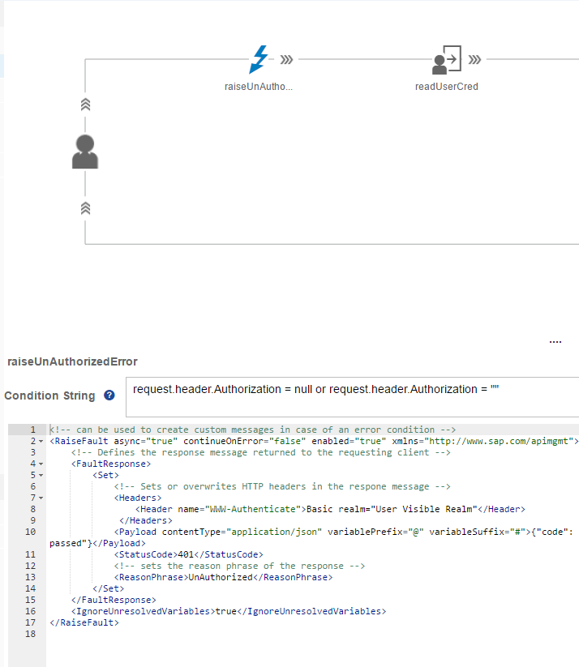
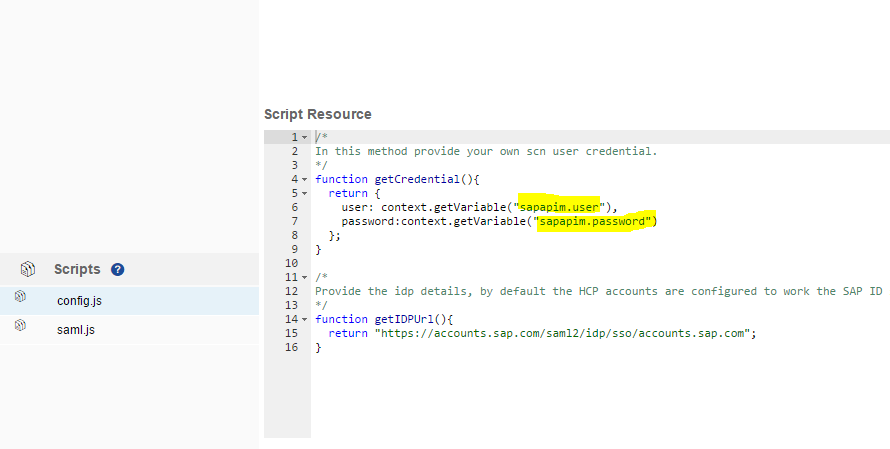

## Basic Authentication in Proxy EndPoint to SAML Authentication for Target End Point

\| [Recipes by Topic](../../../api-recipes-by-usecase.md) \| [Recipes by Type](../../../api-recipes-by-type.md) \| [Request Enhancement](https://github.com/SAP-samples/apibusinesshub-api-recipes/issues/new?assignees=&labels=Recipe%20Fix,enhancement&template=recipe-request.md&title=Improve%20basic-to-SAML-auth-api-proxy ) \| [Report a bug](https://github.com/SAP-samples/apibusinesshub-api-recipes/issues/new?assignees=&labels=Recipe%20Fix,bug&template=bug_report.md&title=Issue%20with%20basic-to-SAML-auth-api-proxy ) \| [Fix documentation](https://github.com/SAP-samples/apibusinesshub-api-recipes/issues/new?assignees=&labels=Recipe%20Fix,documentation&template=bug_report.md&title=Docu%20fix%20basic-to-SAML-auth-api-proxy ) \|

Basic authentications allows a HTTP agent to pass in user name and password while making a call. The user name and password is passed in the http header Authorization

[Download API Proxy](BasicToSamlAuth.zip)

The Authorization field is constructed as follows:-

The username and password are combined with a single colon.
The resulting string is encoded using the Base64.
The authorization method and a space i.e. "Basic " is then put before the encoded string.

On the server side (SAP APIM Proxy endpoint), when Basic Authentication has to be enforced for the user agent then it should respond towards un authenticate request.
For the un authenticated resonse it must respond as follows:-

Set the status code to 401 Un authorized
Set the WWW-Authenticate header to Basic realm="User Visible Realm".

This response informs the user agent that server requests for the user credential to be passed in the Basic Authentication format, in case of browser being the user agent, it results in user/password popup being shown to the user.

In order to model this 401 security challenge flow, in the SAP APIM we would have to use the RaiseFault Policy with the condition set to *request.header.Authorization = null or request.header.Authorization = ""*

Once the user credential is passed by the user agent in the *Authorization* header then it is read using the Basic Authentication Policy with the Operation element set to *Decode*.
![alt text] (./images/decodeusercred.png)

The decoded user, passed is assigned to the flow variable, this flow variable is then used to trigger the SAML flows (used in the constants.js - getCredential() method)

The details of the SAML flow is described in [here](../saml)

## How to use the sample

* Click on [BasicToSamlAuth.zip](./BasicToSamlAuth.zip) and then click on the "View Raw" Link or "Download" button to download the sample.
* Import the Downloaded API Proxy zip into your SAP API management tenancy. Additional instruction for this is available in [link](https://help.hana.ondemand.com/apim_od/frameset.htm?9342a932441e45cd9636eb0a01a89958.html).
