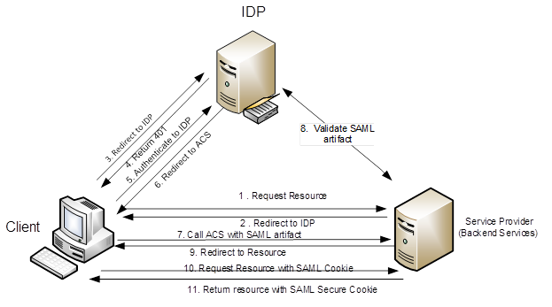
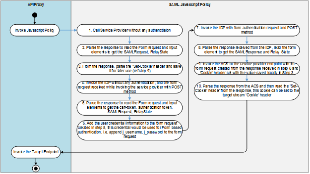

# SAML

\| [Recipes by Topic](../../../api-recipes-by-usecase.md) \| [Recipes by Type](../../../api-recipes-by-type.md) \| [Request Enhancement](https://github.com/SAP-samples/apibusinesshub-api-recipes/issues/new?assignees=&labels=Recipe%20Fix,enhancement&template=recipe-request.md&title=Improve%20SAML-auth-api-proxy ) \| [Report a bug](https://github.com/SAP-samples/apibusinesshub-api-recipes/issues/new?assignees=&labels=Recipe%20Fix,bug&template=bug_report.md&title=Issue%20with%20SAML-auth-api-proxy ) \| [Fix documentation](https://github.com/SAP-samples/apibusinesshub-api-recipes/issues/new?assignees=&labels=Recipe%20Fix,documentation&template=bug_report.md&title=Docu%20fix%20SAML-auth-api-proxy ) \|

In this example, the SAP RealSpend Service from SAP HANA Cloud Platform has been used to demonstrate the SAML authentication, the details of this service is available in [SCN](http://scn.sap.com/community/simple-finance/blog/2016/04/03/try-out-sap-budget-management-beta-on-sap-hana-cloud-platform).

In the config.js JavaScript, provide your SCN user credential which should be used to trigger the SAML flow.

Click [here](https://help.hana.ondemand.com/apim_od/frameset.htm?5b63ed7782ab4b4ea96bf84119059039.html) for more details on JavaScript Policy.

[Download API Proxy](./SAML.zip)

## What is SAML?
Security Assertion Markup Language (SAML) is an XML based, open-standard data format for exchanging authentication and authorization data.  SAML 2.0 is a standard for communication of assertions about principals typically users. The assertion can include the means by which a subject was authenticated, attributes associated with the subject and an attributes associated with the subject and an authorization decision for a given resource. The two main components of a SAML 2.0 landscape are an identity provider and a service or resource provider. The service or resource provider is a system entity that provide a set of applications with a common session management, identity management and trust management. The identity provider is a system entity that manages identity information for principals and provides authentication services to other trusted service provider. In other words, the service providers outsource the job of authenticating the user to the identity provider.

In case of SAML 2.0, the client application will request for the resource from the Service provider (in our case it will be Management Accounting Service in HCP). The Service provider will redirect the call to the configured IDP (SAP ID Service). The client will then perform a security challenge to the IDP. The IDP will return the authentication mechanism (Basic, X509 Certificate, NTLM) that can be used by the client to authenticate to the IDP (in our case we will be using Form based authentication for authenticating to the IDP).  Once the call is authenticated by the IDP, the call will be redirected to ACS (Assertion connectivity service) endpoint along with the SAML artifact. The client would have to then connect to the ACS endpoint with the SAML artifact & SAML cookie received during its call to the Resource Provider. ACS will then connect to the IDP to validate the artifact received and once the artifact has been validated the call we be re-directed to the original requested resource. The client can then redirect the call to the resource endpoint with SAML artifact. The service provider will then authenticate the call and return the client with the SAML secure cookie which can be used by the client in further communications till the time SAML cookie expires.

All the calls required for SAML authentication would be enabled via a JavaScript policy.  SAML 2.0 supports multiple binding and the IDP would support multiple authentication scheme. In this document we have considered only the SAML Post Binding and Form based authentication for authentication with the IDP. The high level design for the JavaScript policy that we have is described as follows:-

## How to use the sample

* Click on [SAML.zip](./SAML.zip) and then click on the "View Raw" Link or "Download" button to download the sample.
* Import the Downloaded API Proxy zip into your SAP API management tenancy. Additional instruction for this is available in [link](https://help.hana.ondemand.com/apim_od/frameset.htm?9342a932441e45cd9636eb0a01a89958.html).
