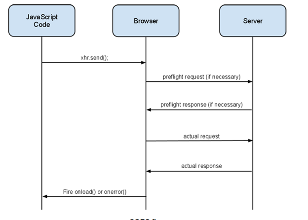

# Cross-Origin Resource Sharing

\| [Recipes by Topic](../api-recipes-by-usecase.md) \| [Recipes by Type](../api-recipes-by-type.md) \| [Request Enhancement](https://github.com/SAP-samples/apibusinesshub-api-recipes/issues/new?assignees=&labels=Recipe%20Fix,enhancement&template=recipe-request.md&title=Improve%20cors-api-proxy ) \| [Report a bug](https://github.com/SAP-samples/apibusinesshub-api-recipes/issues/new?assignees=&labels=Recipe%20Fix,bug&template=bug_report.md&title=Issue%20with%20cors-api-proxy ) \| [Fix documentation](https://github.com/SAP-samples/apibusinesshub-api-recipes/issues/new?assignees=&labels=Recipe%20Fix,documentation&template=bug_report.md&title=Docu%20fix%20cors-api-proxy ) \|

In this example, the SAP Gateway [Demo Service](http://scn.sap.com/docs/DOC-31221) has been used to demonstrate CORS. To register for SAP Gateway System access click [here](http://scn.sap.com/docs/DOC-40986)

[Download API Proxy](./CORS.zip)

## What is Cross-Origin Resource Sharing?
Cross-Origin Resource Sharing (CORS) is a W3C spec that allows cross-domain communication from the browser. By building on top of the XMLHttpRequest object, CORS allows developers to work with the same idioms as same-domain requests.
HTTP requests from JavaScript are traditionally bound by the Same Origin Policy, which means that the Ajax requests must have the same domain and port. The common ways to get around this are using techniques like JSON-P or setting up a custom proxy. By supporting CORS requests, the server can add a few special response headers that would allow the browser to access the data from a different domain.
CORS supports require coordination between both server and client. On the client side (browser side) most of the handling for CORS is automatically done by the browser on behalf of the client which is depicted below in the diagram.

Typically the preflight request is triggered by the browser with http method OPTIONS to the requested server resource. In this call, the server must return the CORS related headers. All CORS headers are prefixed with “Access-Control-“.  The table below describes the CORS header which the server must return

| Header Name        | Description           |
| ------------- |:-------------:|
| Access-Control-Allow-Origin        | This header must be included in all valid CORS responses; omitting the header will cause the CORS request to fail. The value of the header can either echo the Origin request header (as in the example above), or be a '*' to allow requests from any origin.           |
| Access-Control-Allow-Credentials        | By default, cookies are not included in CORS requests. Use this header to indicate that cookies should be included in CORS requests. The only valid value for this header is true (all lowercase).  If this header is specified then * can’t be used with Access-Control-Allow-Origin header it must return the domain name of client which can access the data.This header works in conjunction with withCredentials property on the XMLHttpRequest2 object. For CSRF token handling sine Gateway service also requires cookies to be passed this header must be set to true |
| Access-Control-Expose-Headers   | The XMLHttpRequest 2 object has a getResponseHeader() method that returns the value of a particular response header. During a CORS request, the getResponseHeader() method can only access simple response headers (Cache-Control, Content-Langauge, Content-Type,Expires, Last-Modified, Pragma). For CSRF token handling sine Gateway service also requires client to read the custom header x-csrf-token therefore this header would be have to set to include x-csrf-token |
| Access-Control-Allow-Methods     | Comma-delimited list of the supported HTTP methods |
| Access-Control-Allow-Headers    | Comma-delimited list of the supported request headers. |

In case the underlying target service doesn't support OPTIONS http method and then routerule can be used to ensure that the OPTIONS call is not routed to the target services but then the response with CORS header is returned by the SAP API Management. The custom header can be returned using the [Assign Message](https://help.hana.ondemand.com/apim_od/frameset.htm?523efe6d0a9d43beb5d62ad07937578f.html) policy.

## How to use the sample

* Click on [CORS.zip](./CORS.zip) and then click on the "View Raw" Link or "Download" button to download the sample.
* Import the Downloaded API Proxy zip into your SAP API management tenancy. Additional instruction for this is available in [link](https://help.hana.ondemand.com/apim_od/frameset.htm?9342a932441e45cd9636eb0a01a89958.html).
