<p align="center">
  <h1 align="center">Principal Propagation with SAP API Management</h1>
  <p align="center">
    This documentation depicts the step by step configuration for Principal Propagation on SAP API Management on Cloud Foundry . 
    <br />
  </p>
</p>

<!-- TABLE OF CONTENTS -->
<details open="open">
  <summary>Table of Contents</summary>
  <ol>
    <li>
      <a href="#about">About</a>
    </li>
    <li>
      <a href="#prerequisites">Prerequisites</a>
       <ul>
        <li><a href="#activate-trial">Activate Trial</a></li>
        <li><a href="#create-subaccounts">Create subaccounts</a></li>
        <li><a href="#enable-cloud-foundry">Enable Cloud Foundry</a></li>
        <li><a href="#configure-subaccount-blue">Configure subaccount:blue</a>
       <ul>
        <li><a href="#configure-entitlements">Configure Entitlements</a></li>
        <li><a href="#service-instance-destination">Service Instance for Destination</a></li>
        <li><a href="#service-instance-xsuaa">Service Instance for XSUAA</a></li>
        <li><a href="#service-instance-opproxy">Service Instance for On-premise-connectivity</a></li>
      </ul>
         </li>
        <li><a href="#configure-subaccount-red">Configure subaccount:red</a>
          <ul>
        <li><a href="#service-instance-destination">Service Instance for Destination</a></li>
        <li><a href="#service-instance-xsuaa">Service Instance for XSUAA</a></li>
      </ul>
         </li>
        <li><a href="#clone-repository">Clone Repository</a></li>
      </ul>
    </li>
    <li>
      <a href="#prepare">Prepare</a>
       <ul>
        <li><a href="#create-api-provider">Create API Provider</a></li>
        <li><a href="#create-api-proxy">Create API Proxy</a></li>
        <li><a href="#import-policy-template">Import Policy Template</a></li>
        <li><a href="#apply-policy-template-to-api-proxy">Apply Policy Template to API Proxy</a></li>
      </ul>
    </li>
    <li>
      <a href="#setup-and-configuration">Setup and Configuration</a>
      <ul>
        <li><a href="#own-CF-sub-account">Own CF Subaccount</a>
        <ul>
        <li><a href="#own-CF-sub-account">Generate and Upload Destination</a></li>
        <li><a href="#configure-api-proxy">Configure API Proxy</a></li>
      </ul>
        </li>
        <li><a href="#cf-cf-subaccount">CF-CF Subaccount</a>
         <ul>
         <li><a href="#establish-trust-between-sub-accounts">Establish Trust Between sub-accounts</a></li>
        <li><a href="#generate-and-upload-destination">Generate and Upload Destination</a></li>
        <li><a href="#configure-api-proxy">Configure API Proxy</a></li>
      </ul>
        </li>
        <li><a href="#neo-cf-subaccount">NEO-CF Subaccount</a></li>
        <li><a href="#azure-active-directory">Azure Active Directory</a></li>
      </ul>
    </li>
     <li>
      <a href="#consumption">Consumption</a>
        <ul>
        <li><a href="#postman-collection">Postman Collection</a></li>
        <li><a href="#cf-apps">CF Apps</a></li>
        <li><a href="#ui5-application">UI5 Application</a></li>
      </ul>
    </li>
  </ol>
</details>


<!-- ABOUT -->
## About

* [Overview of Principal Propagation ](https://help.sap.com/viewer/cca91383641e40ffbe03bdc78f00f681/Cloud/en-US/e2cbb48def4342048362039cc157b12e.html)
* This documentation depicts the step-by-step configurations required to setup Principal Propagation for the following scenarios within the Cloud Foundry capability SAP API Management under the SAP Integration Suite in SAP BTP Platform.
* A single API Proxy shall be configured to provide for Principal Propagation from the same and different sub-accounts within CF runtime of SAP APIM
* The Configurations of the Cloud Connector and the backend systems are left out of scope.
* The Configurations of SAP API Management applies to Prod,Canary,Trial landscape,this document only depicts the Trial setups. The configurations remain same for other landscapes.


<!-- Prerequisites -->
## Prerequisites
### Activate Trial 
 [Activate your Trial Account](https://developers.sap.com/tutorials/hcp-create-trial-account.html)
### Create Subaccounts
Create Two sub-accounts within the Trial Global account </br>
  a. Sub-account name: **red** , Sub-domain name : red , Region of choice </br>
  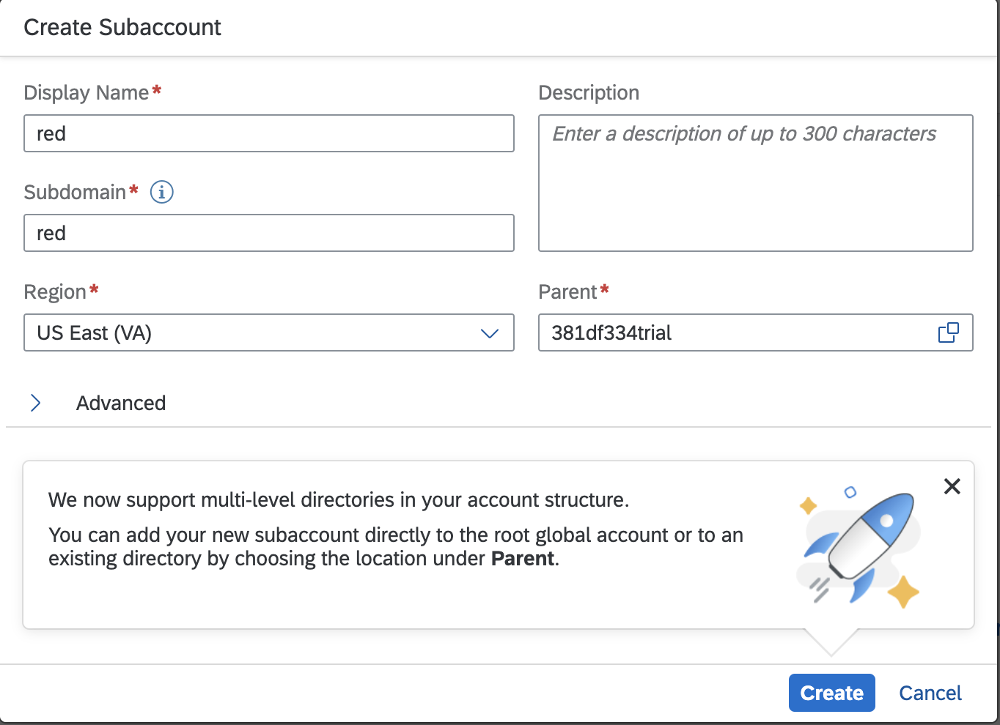</br>
  b. Sub-account name: **blue** , Sub-domain name : blue, Region of choice </br>
  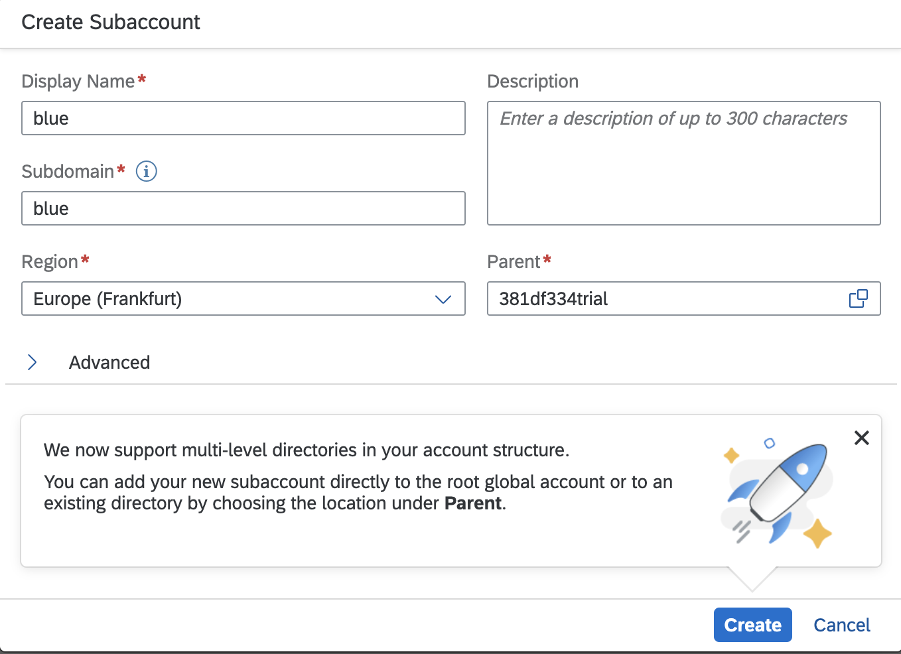</br>
  
### Enable Integration Suite
In sub-account:**blue** enable the Integration Suite and add SAP API Management cabaility by [Setup Integration Suite Trial](https://developers.sap.com/tutorials/cp-starter-isuite-onboard-subscribe.html)
### Enable Cloud Foundry 
Enable Cloud Foundry in both sub-accounts </br>

### Configure subaccount blue
In sub-account:**blue** </br>

#### Configure Entitlements
Click on Entitlements-> Configure Entitlements -> Add Service Plans-> API Management, API Portal , enable and save </br> **on-premise connectivity** </br> **apiportal-apiaccess** </br></br>
    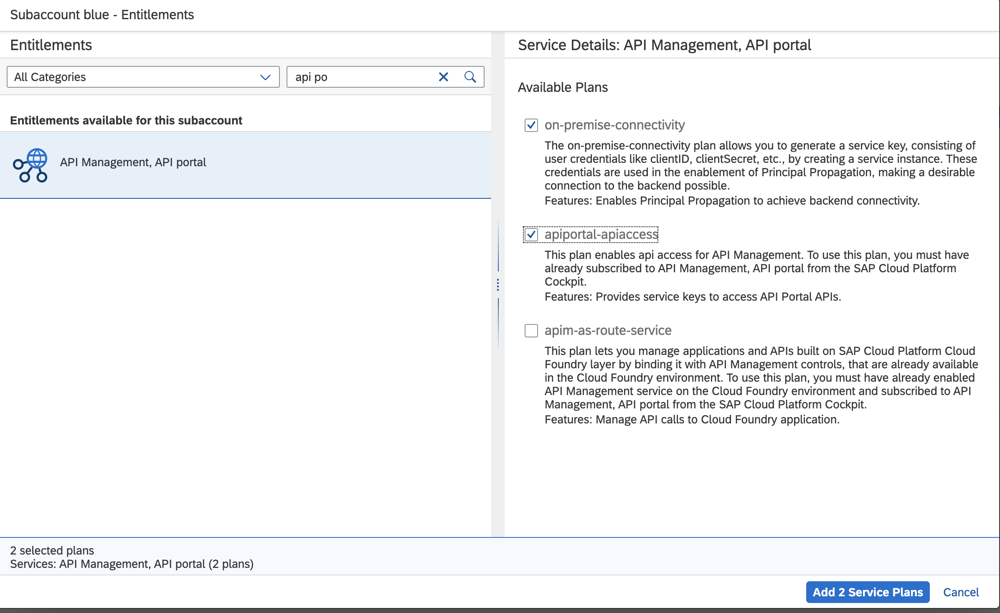</br>
    
#### Service Instance OPProxy
Enable </br> Service Instances: **API Management , API Portal** </br> Plan: **on-premise-connectivity** </br> Instance Name: **blueop** </br></br>
    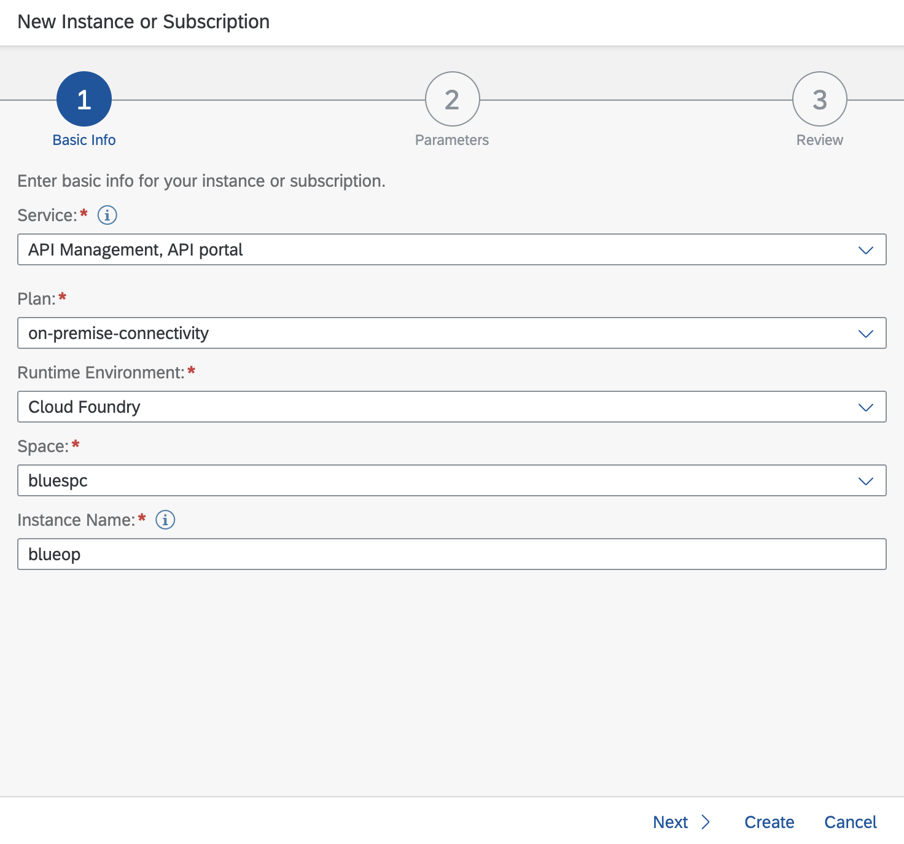</br>
    
#### Service Instance XSUAA
Enable </br> Service Instances: **Authorization and Trust Management Service** </br> Plan: **application** </br> Instance Name: **bluexsuaa** </br></br>
    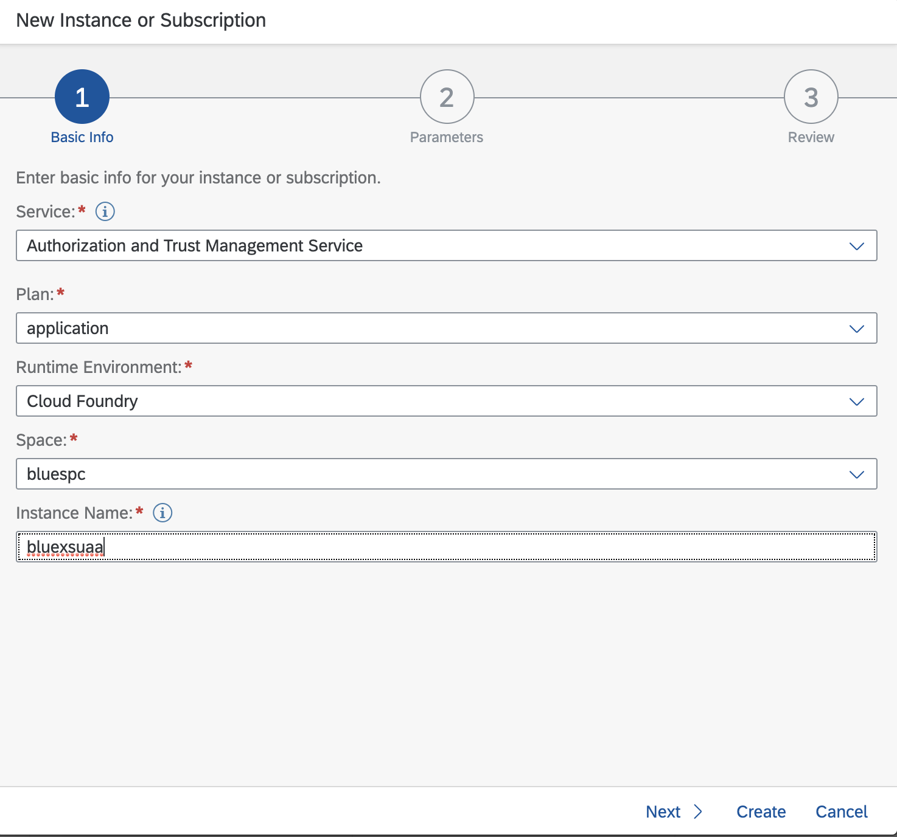</br>
    
#### Service Instance Destination
Enable </br> Service Instances: **Destination** </br> Plan: **lite** </br> Instance Name: **bluedest** </br></br>
    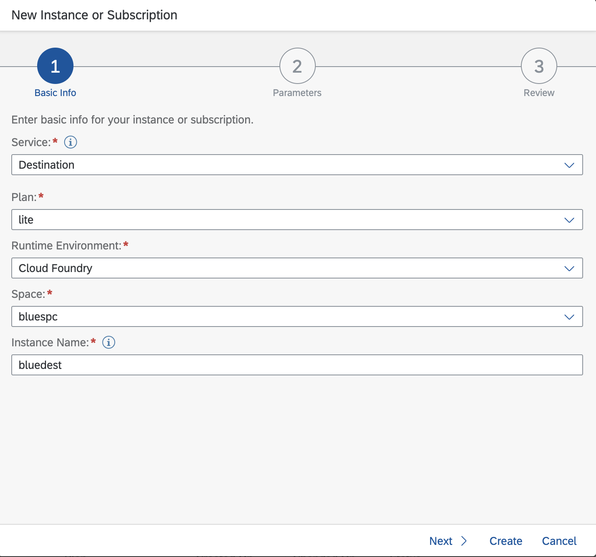</br>
    
#### Generate Service keys
Create Service Keys for **blueop** , **bluexsuaa** , **bluedest** respectively </br>

### Configure subaccount red
In sub-account:**red** </br>
  a. Enable </br> Service Instances: **Authorization and Trust Management Service** </br> Plan: **application** </br> Instance Name: **redxsuaa** </br></br>
    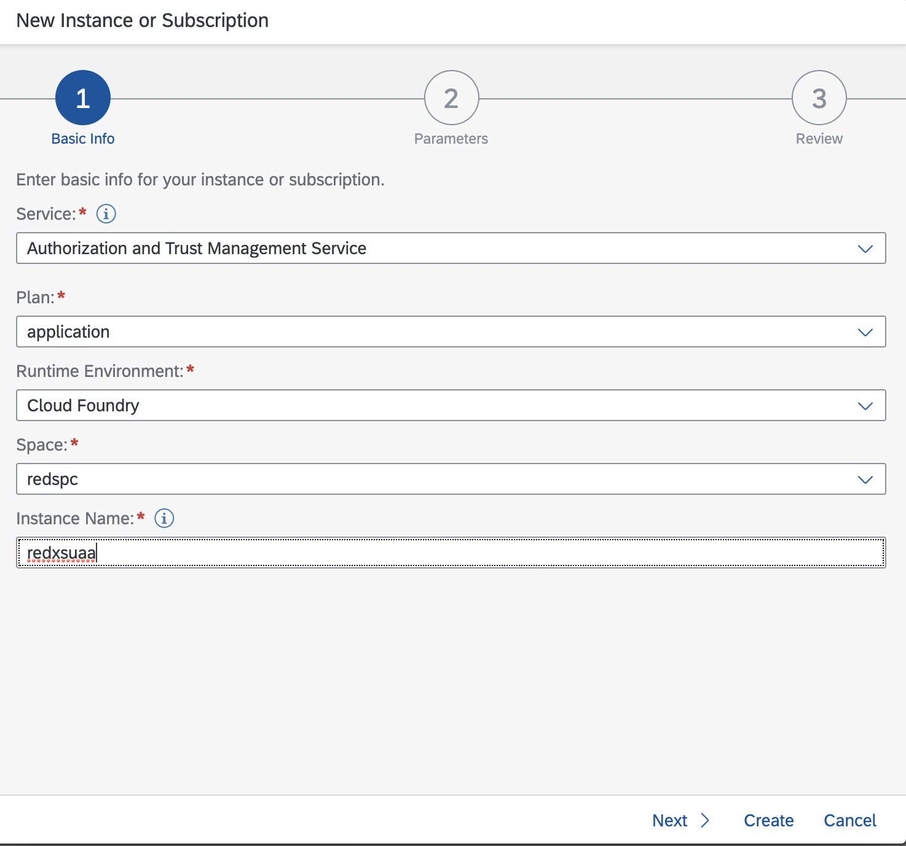</br>
  b. Enable </br> Service Instances: **Destination** </br> Plan: **lite** </br> Instance Name: **reddest** </br></br>
    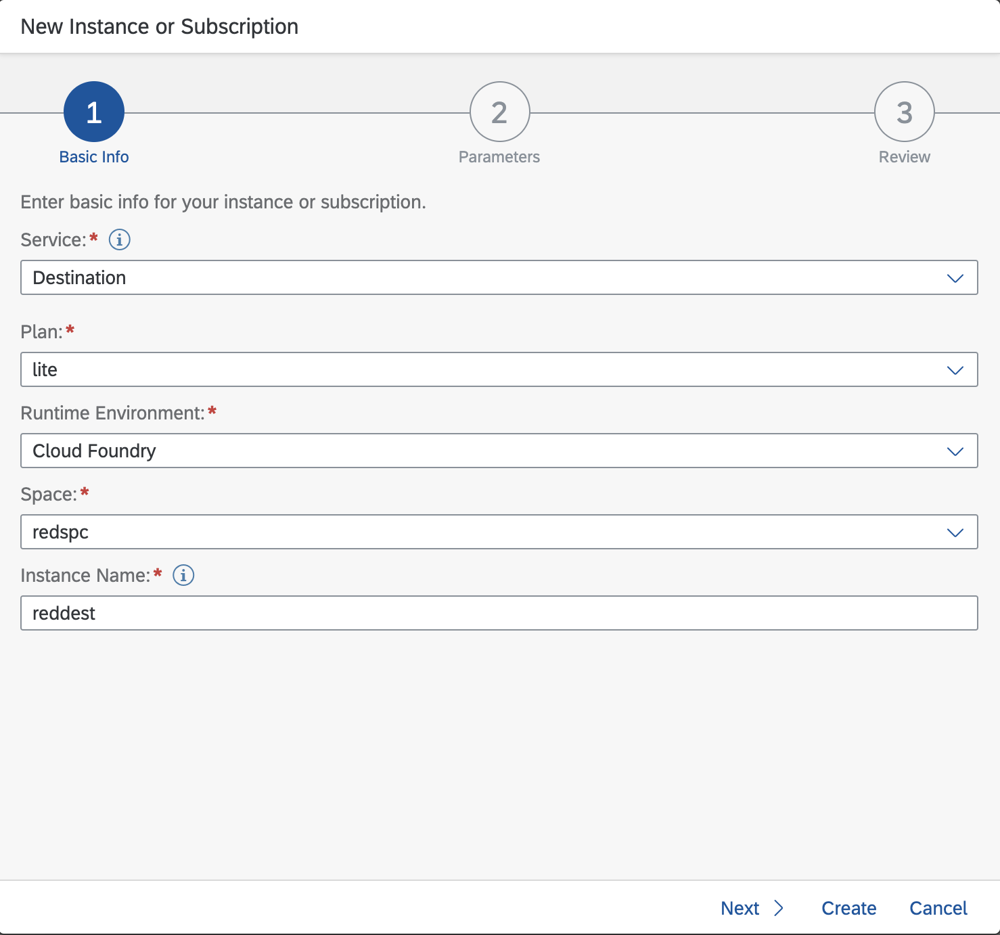</br>
  e. Create Service Keys for **redxsuaa** , **reddest** respectively </br>
### Clone Repository
Clone the repo
   ```sh
   git clone https://github.com/SAP/apibusinesshub-api-recipes.git
   ```


## Prepare
Within the API Portal Application do the following
### Create API Provider
Navigate to Configure -> API Providers -> Create  </br>
**Host** : Virtual Host of the backend system configured within Cloud Connector </br>
**Port** : Port of the Virtual Host configured within Cloud Connector </br>
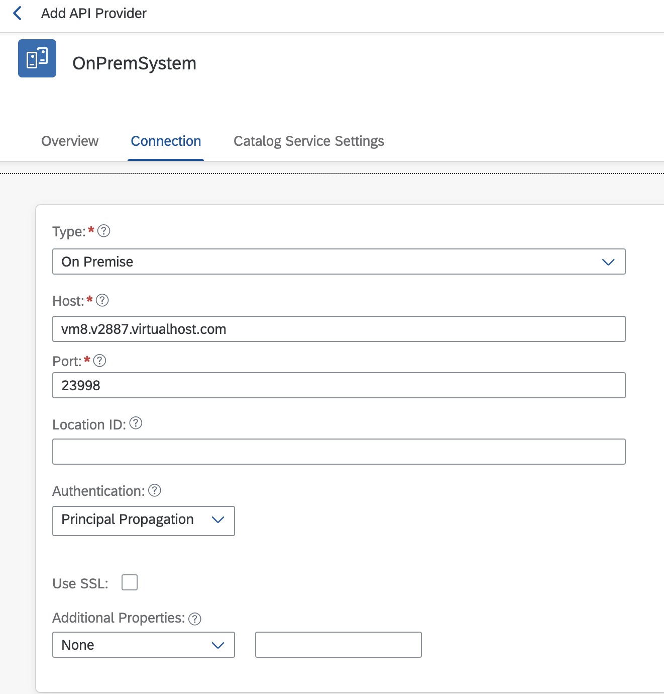</br>

### Create API Proxy
Navigate to Develop -> APIs-> Create
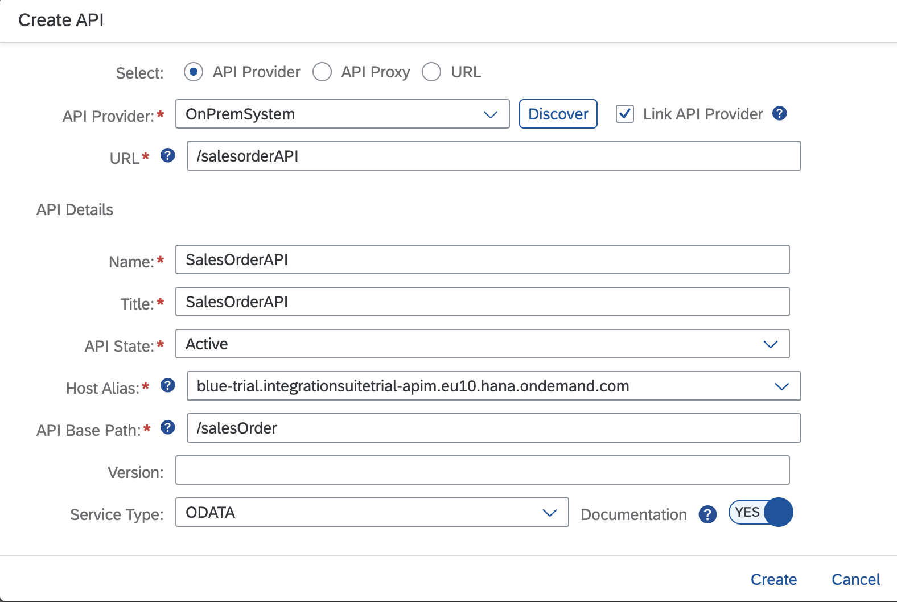</br>


### Import Policy Template
Navigate to Develop -> Policy Templates -> Import -> Browse </br>
Import the Policy Template avialble within the [cloned repository](#clone-repository) path: </br> 
/apibusinesshub-api-recipes/principalPropagation/PrincipalPropagationOnCF

### Apply Policy Template to API Proxy
Develop->APIs ->Click on the SalesOrder API created above and follow<br>
Policy ->Edit ->Policy Template ->Apply ->Check PrincipalPropagationOnCF ->Apply ->Update ->Save ->Deploy </br>
The policies should be applied </br>


<!-- Setup and Configuration -->
## Setup and Configuration

### Own CF Subaccount

In this case , **the User token generation and the SAP API Management service is hosted within the same sub-account**. The below picture depicts the landscape. </br>
    </br>
    Flow Summary:
    
    1. The User Logs in using the XSUAA service instance. A token is generated in exchange of username and password . This token contains the User Principle. 
    2. The Client requests the API Proxy endpoint and passes the token as part of the header request
    3. API Proxy verifies if the token is valid and requests Destination Service to exchange the token
    4. The token is passed to the Cloud Connector which queries the backend to present the response
    
### Steps to enable the Flow
#### Generate and Upload Destination
Target subaccount : blue </br>
Perform the steps mentioned [here](utility/readme.md#generate-destination-for-oauth2usertokenexchange) to generate and upload the Destination
#### Configure API Proxy

## CF-CF subaccount 
In this case , **the User token generation and the SAP API Management service is hosted in different sub-account**. The below picture depicts the landscape. </br>
    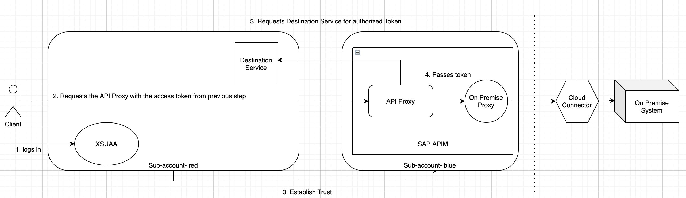</br>
    Flow Summary:
    
    1. The User Logs in using the XSUAA service instance from origin sub-account. A token is generated in exchange of username and password . This token contains the User Principle. 
    2. The Client requests the API Proxy endpoint(hosted on target sub-account) and passes the token as part of the header request
    3. API Proxy verifies if the token is valid and requests Destination Service(on the origin account) to exchange the token
    4. The token is passed to the Cloud Connector which queries the backend to present the response

### Steps to enable the Flow
#### Establish Trust between sub-accounts
Target subaccount : blue </br>
Origin subaccount : red </br>
Perform the steps mentioned [here](utility/readme.md#generate-trustxml) to generate the Trust XML
#### Generate and Upload Destination
Target subaccount : blue </br>
Origin subaccount : red </br>
Perform the steps mentioned [here](utility/readme.md#generate-destination-for-oauth2samlbearerassertion) to generate and upload the Destination
#### Configure API Proxy

Contributions are what make the open source community such an amazing place to be learn, inspire, and create. Any contributions you make are **greatly appreciated**.

1. Fork the Project
2. Create your Feature Branch (`git checkout -b feature/AmazingFeature`)
3. Commit your Changes (`git commit -m 'Add some AmazingFeature'`)
4. Push to the Branch (`git push origin feature/AmazingFeature`)
5. Open a Pull Request