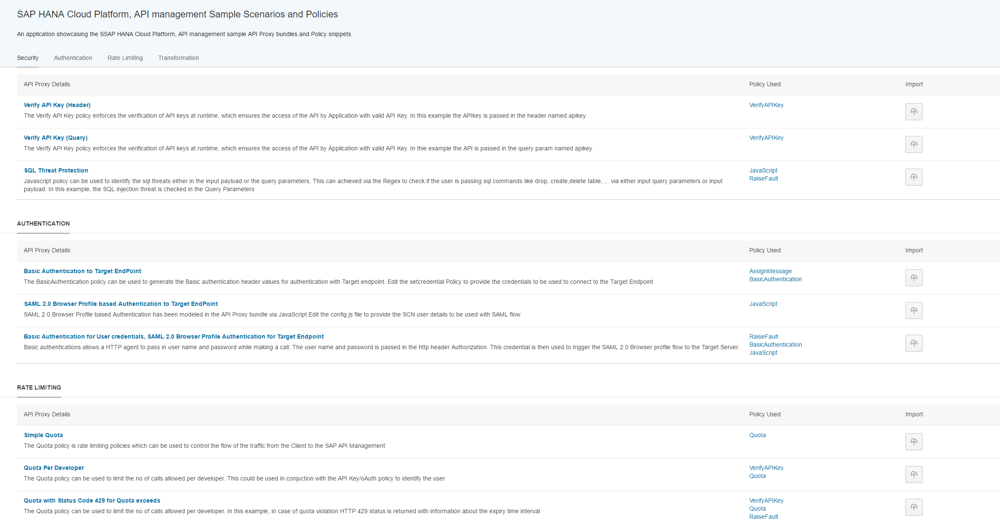
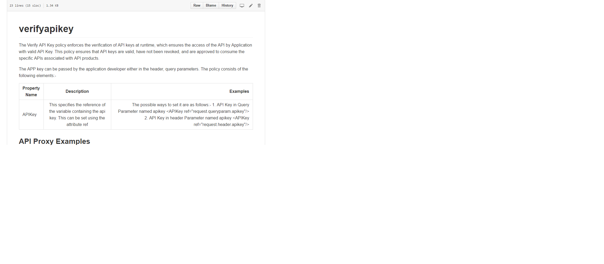
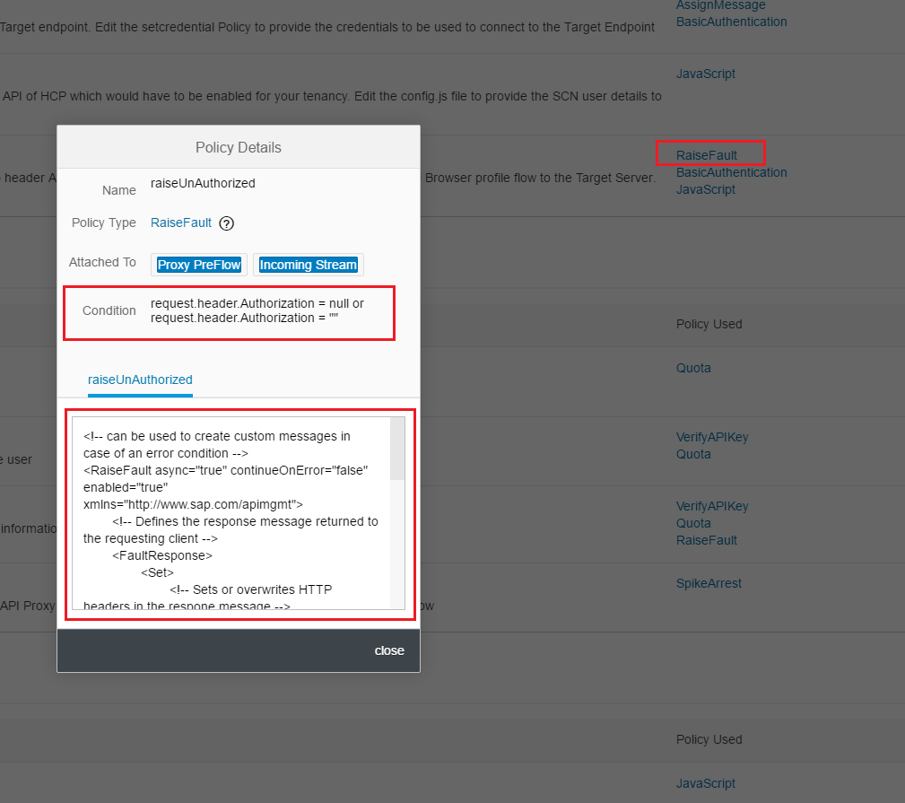
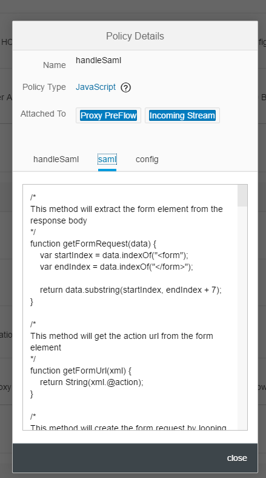
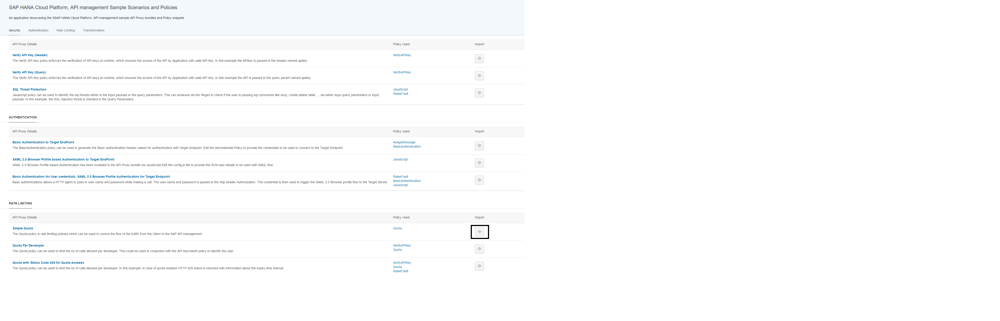

# SAP HANA Cloud Platform, API management Sample Scenarios setup

SAP HANA Cloud Platform, API management Sample Scenario is a fiori based application using which the sample api proxy bundles, policies could be browsed and then this bundle can be deployed into your api portal tenancy.

1. The pre-requisite for this application is to have the tenancy for the SAP HANA Cloud Platform, API management in case you would like to import the sample scenarios to the API Portal.
2. [Import](https://help.hana.ondemand.com/help/frameset.htm?a2550c3fcf2b430f94f99072677bf9ec.html) the HANA Cloud Platform Destination file available in [/destination/apiportal](./destination/apiportal)
3. Edit the destination file to provide details the user credential and API Portal host/port
4. [Import](https://help.hana.ondemand.com/webide/frameset.htm?344e8c91e33b4ae8b4032709c45776a3.html) and [Deploy](https://help.hana.ondemand.com/webide/frameset.htm?463b52bd34de4549ad05f6282ada02d6.html) Sample scenarios available in [/firori/SAPAPIMSampleScenarios.zip](./fiori/SamplesScenarios.zip) using [SAP Web IDE](https://help.hana.ondemand.com/webide/frameset.htm?51321a804b1a4935b0ab7255447f5f84.html) 

### Available Features

1. Launch the UI

2. Click on the scenario title to view the details

3. Click on the policy to view details of the policy used in the scenario like the name of the policy, conditions if any that needs to be applied, the endpoints/stream where the policy would have to be attached and the policy snippet

4. For the JavaScript based policy to view details of the main script and the helper script (if any) used in the policy snippet

5. Click on the Import button to import the sample scenarios into the api portal tenancy

 

